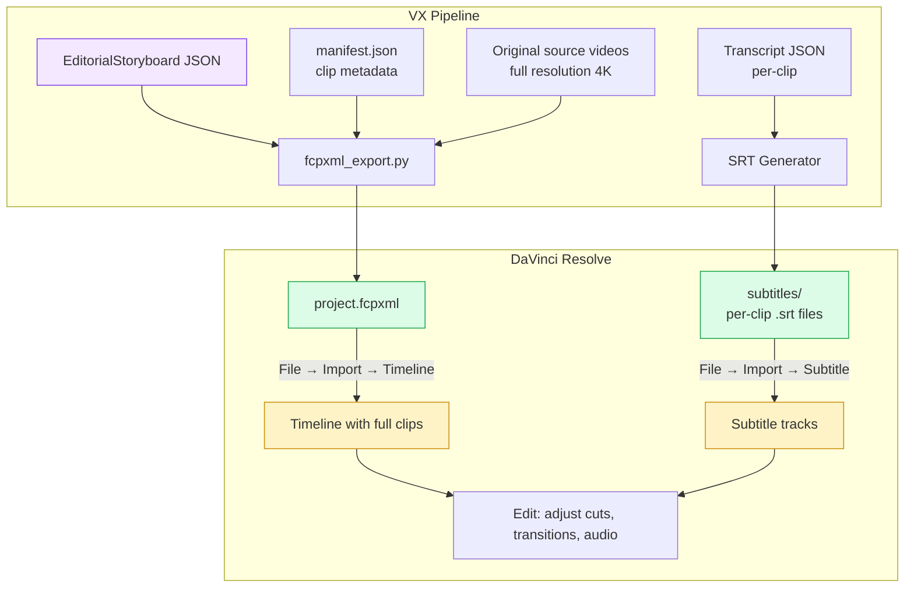
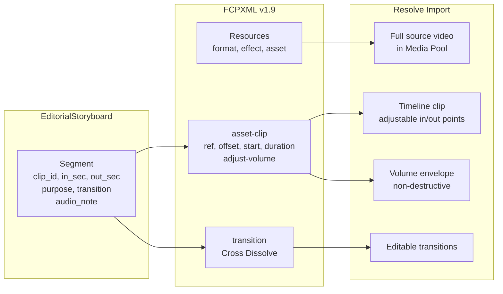

# VX — AI Video Editor

Turn raw trip footage into polished vlogs with AI.

## Philosophy

This project exists because most people come back from trips with hours of raw clips and never edit them. The gap between "raw footage on a hard drive" and "a video worth sharing" is enormous — it requires the eye of an editor, the patience to review every clip, and the craft to assemble a story.

VX automates the editor's thinking, not just the cutting. Here's what that means:

**An editor's real job is not cutting video.** It's watching all the dailies, understanding what story the footage can tell, identifying the strongest moments, and making hundreds of small decisions about what to keep, what to cut, and in what order. The mechanical act of cutting is the easy part. VX focuses on automating the hard part — the editorial judgment.

**The footage dictates the story.** You don't start with a script and find clips to match it. You start with what you actually shot — shaky B-roll, accidental recordings, someone talking with their mouth full — and find the best possible story within those constraints. The AI reviews every clip the same way an editor would: what's usable? what's the energy? who's in it? where are the moments?

**Context makes the difference.** An editor who knows "that's my sister, this was her first time surfing" makes a fundamentally different video than one who just sees "woman on surfboard." The briefing system exists because the filmmaker's intent and relationships are the single biggest input to editorial quality. The AI can see what's in the frame; only you know why it matters.

**Structure before style.** A good edit follows: hook the viewer, establish context, build through the body, hit a climax, close with an outro. This isn't a formula — it's how stories work. VX produces a story arc with these beats mapped to specific clips and timestamps, because a well-structured 2-minute video beats a meandering 10-minute one every time.

**The output must be usable or it's worthless.** This is automation, not assistance. If the AI produces a storyboard that a human still needs to heavily rework, we've just added a step instead of removing one. Every segment in the EDL has precise in/out timestamps in seconds. The rough cut assembles from these without any human intervention. The HTML preview lets you verify and adjust, but the default should be good enough to share.

**Iterate, don't perfect.** The versioning system exists because the first AI pass won't be the best. Run analyze, review, adjust the briefing, run again. Each version is preserved with full lineage tracking — every artifact records which inputs produced it, what model and settings were used, and whether it completed or failed. Compositions let you mix-and-match versions across phases (storyboard v2 + monologue v1). Experiment tracks let you try different pipeline orderings (narrative-first vs vision-first) without disturbing the main workflow. The interactive preview lets you nudge cut points without re-running the AI. The goal is convergence: each pass gets closer to what you want.

## How It Works

```
Raw Clips                       You shot 17 clips on your trip.
    │                           4K, handheld, no plan, mixed quality.
    │                           Sony H.264, iPhone HEVC, any mix.
    │
    ▼
┌─────────┐                     ffmpeg downscales each clip to a tiny proxy
│ Ingest  │                     (360p, 1fps, ~5MB). Extracts frames, detects
└────┬────┘                     scene changes, pulls audio. Runs 4 clips in
     │                          parallel. Cached — never re-processed.
     │                          Hardware-accelerated HEVC decode (VideoToolbox).
     ▼
┌──────────┐                    Detects source formats (resolution, codec,
│ Format   │                    aspect ratio, orientation, fps). Filters
│ Analyzer │                    Live Photo .mov files. Recommends output
└────┬─────┘                    format; user picks resolution, codec (H.264/
     │                          H.265), and fit mode (pad/crop) when sources
     │                          are mixed.
     ▼
┌──────────┐                    Optional creative direction. User picks a
│  Style   │                    style preset (e.g., Silent Vlog) that adds
│  Preset  │                    AI guidance to Phase 1/2 prompts and may
└────┬─────┘                    enable Phase 3 (visual monologue).
     │
     ▼
┌──────────┐                    AI quick-scans all footage, then asks
│ Briefing │  (AI-guided)       targeted questions based on what it saw:
└────┬─────┘                    "Who is the person in the green shirt?"
     │                          Saved as context for all downstream stages.
     │                          Uploads proxies to Gemini File API (cached
     │                          for reuse by transcription and Phase 1).
     ▼
┌──────────────┐                AI transcribes each clip's audio via
│ Transcription│                Gemini (speaker ID, sound events) or
└──────┬───────┘                mlx-whisper (local). Uses speaker names
       │                        from briefing for better ID. Cached per
       │                        clip. VTT + preview HTML for verification.
       ▼
┌─────────────┐                 The AI watches each clip's proxy video and
│  Phase 1    │                 produces a structured review: what's in it,
│ Clip Review │                 who appears, quality assessment, which parts
└──────┬──────┘                 are usable vs throwaway, key moments.
       │                        Uses briefing context (people names, intent).
       │                        One LLM call per clip. Cached per clip.
       ▼
┌─────────────┐                 The AI acts as creative editor. It sees ALL
│  Phase 2    │                 clip reviews + transcripts + your briefing
│  Editorial  │                 context. For ≤10 clips, can also see proxy
│  Assembly   │                 videos (--visual). Produces a complete edit
└──────┬──────┘                 plan: story arc, cast, EDL with precise
       │                        in/out timestamps (seconds), pacing, music.
       │                        One LLM call. Structured output (Pydantic).
       │
       ├──→ editorial.json       The structured data. Source of truth.
       ├──→ editorial.md         Human-readable rendered view.
       └──→ preview.html         Interactive: click segments to preview
                                 video, drag to adjust cut points,
                                 export refined JSON.
       │
       ▼
┌─────────────┐                 Optional (if style preset has Phase 3).
│  Phase 3    │                 Generates text overlay/monologue plan from
│  Monologue  │                 the storyboard + transcripts. Produces
└──────┬──────┘                 timed text cards for silent-style vlogs.
       │                        One LLM call. Preset-dependent.
       ▼
┌─────────┐                     Loads the JSON. Validates timestamps against
│   Cut   │                     actual clip durations (clamps out-of-bounds).
│  (ffmpeg)│                     Normalizes each segment to the target format
└────┬────┘                     (scaling, padding, rotation, fps). Concatenates
     │                          into rough_cut.mp4. No LLM call — pure execution.
     │
     └──→ rough_cut.mp4          Watch it. If it's not right, adjust the
          preview.html           preview, export new JSON, re-cut.
```

## Quick Start

```bash
uv venv && uv pip install -e ".[dev]"
cp .env.example .env   # Add your GEMINI_API_KEY

vx                     # Launch interactive mode
```

## CLI

### Interactive mode (recommended)

```bash
vx                                    # Guided workflow with menus and prompts
```

### Direct commands

```bash
vx new my-trip ~/footage/             # Create project, preprocess clips
vx transcribe my-trip                 # Transcribe audio (auto-detect provider)
vx transcribe my-trip --provider gemini  # Gemini: speaker ID + sound events
vx transcribe my-trip --provider mlx  # mlx-whisper: local, fast, no API cost
vx transcribe my-trip --force --srt   # Overwrite cached + generate SRT/VTT
vx brief my-trip --scan               # AI-guided briefing (quick scan + questions)
vx analyze my-trip                    # Briefing + Phase 1 + Phase 2
vx analyze my-trip --visual           # Phase 2 sees proxy videos (richer edits)
vx analyze my-trip --dry-run          # Estimate token usage and cost
vx analyze my-trip --force            # Re-run Phase 1 reviews from scratch
vx analyze my-trip --no-interactive   # Skip briefing questions
vx cut my-trip                        # Assemble rough cut (no LLM)
vx export-xml my-trip                 # Export FCPXML for DaVinci Resolve / FCP
vx export-xml my-trip --no-srt        # FCPXML only, skip subtitle export

vx projects                           # List all projects
vx status my-trip                     # Per-clip cache, versions, LLM usage
vx config --provider gemini           # Set defaults
```

### Versioning and composition

```bash
vx versions my-trip                   # List all artifact versions with lineage
vx versions my-trip --all             # Include failed/pending versions
vx compose my-trip                    # Create a named composition (interactive)
vx cut my-trip --composition my-cut   # Assemble using a named composition
vx cut my-trip --storyboard v3        # Use a specific storyboard version
vx cut my-trip --storyboard v3 --monologue-version v1  # Mix specific versions
vx monologue my-trip --storyboard v2  # Generate monologue from a specific storyboard
vx analyze my-trip --track experiment # Run analysis on an experiment track
vx track list --project my-trip       # List experiment tracks
vx track create narrative-first --project my-trip  # Create a new track
```

### Interactive HTML preview

The preview (`storyboard/*_preview.html`) is an editing tool:
- Click timeline segments → video preview modal with the clip's proxy
- Draggable in/out range handles to adjust cut points
- Preview the selected range, play the full clip for context
- Export adjusted JSON → feed back into `vx cut`

## Prerequisites

- Python 3.11+
- [uv](https://docs.astral.sh/uv/) or pip
- ffmpeg & ffprobe (`brew install ffmpeg`)
- `GEMINI_API_KEY` and/or `ANTHROPIC_API_KEY` in `.env`

## Setup

```bash
cd ai-video-editor
uv venv && uv pip install -e ".[dev]"
cp .env.example .env
```

## Project Library

```
library/
  my-trip/
    project.json                        # Type, provider, style, versions, tracks
    compositions.json                   # Named version combinations for cuts
    user_context.json                   # Briefing answers (people, tone, etc.)
    quick_scan.json                     # AI quick scan results (smart briefing)
    manifest.json                       # Aggregated clip metadata
    traces.jsonl                        # LLM call traces (tokens, cost, timing)
    file_api_cache.json                 # Gemini File API URI cache (for reuse)
    quick_scan_v1.json                  # AI quick scan (versioned)
    quick_scan_latest.json              # Symlink → latest version
    user_context_v1.json                # Briefing answers (versioned)
    user_context_latest.json            # Symlink → latest version
    clips/
      20260330_C0059/                   # Per-clip (parallel preprocessed, cached)
        source/  proxy/  frames/  scenes/
        audio/
          *.wav                         # Extracted audio (16kHz mono)
          transcript_gemini_v1.json     # Transcription (versioned, provider-tagged)
          transcript_latest.json        # Symlink → latest transcript (any provider)
          transcript.vtt                # WebVTT subtitles
          transcript_preview.html       # Video + captions side-by-side viewer
        review/
          review_gemini_v1.json         # Phase 1 review (versioned, cached)
          review_gemini_v1.meta.json    # Artifact sidecar (lineage, config, status)
          review_gemini_latest.json     # Symlink → latest version
    storyboard/
      editorial_gemini_v1.json          # Phase 2: structured data (source of truth)
      editorial_gemini_v1.meta.json     # Artifact sidecar (inputs, config snapshot)
      editorial_gemini_v1.md            # Rendered markdown
      monologue_gemini_v1.json          # Phase 3: text overlay plan
      monologue_gemini_v1.meta.json     # Artifact sidecar (storyboard lineage)
    exports/
      v1/                               # Phase 2 storyboard preview (tied to storyboard version)
        preview.html                    # Interactive preview
        thumbnails/
      cuts/                             # Rough cuts (own version sequence)
        cut_001/
          rough_cut.mp4
          preview.html
          composition.json              # Full provenance manifest
          segments/
        latest -> cut_001/
      my-trip.fcpxml                    # FCPXML for DaVinci Resolve / FCP import
      subtitles/                        # Per-clip SRT files for subtitle import
        20260330_C0059.srt
```

## Source Code

```
src/ai_video_editor/
  cli.py               # CLI entry point (vx command)
  interactive.py        # Interactive TUI (questionary/prompt_toolkit)
  briefing.py           # Editorial briefing + AI-guided smart briefing (quick scan)
  transcribe.py         # Audio transcription (mlx-whisper local + Gemini cloud)
  tracing.py            # LLM call tracing (tokens, cost, timing per API call)
  models.py             # Pydantic models (EditorialStoryboard, ArtifactMeta, Composition, etc.)
  config.py             # Settings, paths, provider configs, OutputFormat, track-aware paths
  preprocess.py         # ffmpeg: proxy, frames, scenes, audio (parallel, cached, hwaccel)
  format_analyzer.py    # Source format detection, Live Photo filter, output recommendation
  editorial_prompts.py  # Phase 1 + 2 prompt engineering
  editorial_agent.py    # Multi-clip orchestrator (transcribe, review, assemble)
  render.py             # Markdown + interactive HTML from Pydantic models
  rough_cut.py          # Validation + format-normalized ffmpeg assembly (no LLM)
  fcpxml_export.py      # FCPXML v1.9 export for DaVinci Resolve / Final Cut Pro
  versioning.py         # Composable versioning: begin/commit/fail, lineage, compositions
```

## LLM Calls

| What | Input | Output | LLM? |
|------|-------|--------|------|
| Preprocess | Raw 4K clips | Proxy, frames, scenes, audio | No — ffmpeg |
| Transcribe | Proxy video or WAV | transcript.json + VTT + preview | Yes — per clip, cached (Gemini or mlx-whisper) |
| Quick Scan | All proxy videos | Quick overview for smart briefing | Yes — one call (Gemini) |
| Briefing | AI scan + user answers | user_context.json | Interactive (AI-guided or manual) |
| Phase 1 | Proxy video + transcript | Structured review JSON | Yes — per clip, cached |
| Phase 2 | Reviews + transcripts + briefing (+ videos with --visual) | EditorialStoryboard (Pydantic JSON) | Yes — one call |
| Render | Structured JSON | Markdown + HTML preview (with transcript overlay) | No — templates |
| Cut | Structured JSON | rough_cut.mp4 | No — ffmpeg |
| Export XML | Structured JSON + manifest | .fcpxml + .srt files | No — XML generation |

## LLM Usage, Cost, and Tracing

### How LLM calls work

Every Gemini API call goes through `traced_gemini_generate()` in `tracing.py`. This wrapper:
1. Records input/output token counts from Gemini's `usage_metadata`
2. Estimates cost based on the model's per-token pricing
3. Times the call (including retries)
4. Appends a JSON line to `library/<project>/traces.jsonl`
5. Retries automatically on transient errors (429, 500, 503) with exponential backoff (max 3 retries)

After each LLM call, a **response quality validator** checks the output:
- **Phase 1**: validates timestamp ranges, segment boundaries, clip ID correctness
- **Phase 2**: validates all segment clip IDs exist, timestamps within clip durations, non-empty storyboard
- If critical issues are found (e.g., all timestamps invalid), the call is retried once with validation feedback injected into the prompt

### Cost tracking

Every pipeline run prints a cost summary:

```
  [Phase 1] 12 calls | 48,320 tokens | ~$0.0242 | 34.2s
  [Phase 2] 1 calls | 15,800 tokens | ~$0.0079 | 8.1s
  [Pipeline Total] 13 calls | 64,120 tokens | ~$0.0321 | 42.3s
```

To estimate costs before running:

```bash
vx analyze my-trip --dry-run          # Estimate token usage and cost
vx analyze my-trip --dry-run --visual # Compare text-only vs visual mode cost
```

To set a spending limit:

```bash
vx analyze my-trip --max-cost 0.50    # Abort if cumulative cost exceeds $0.50
```

Historical cost is available via:

```bash
vx status my-trip                     # Shows cumulative LLM usage with per-phase breakdown
```

The trace file `traces.jsonl` contains one JSON object per LLM call with fields: `phase`, `model`, `clip_id`, `input_tokens`, `output_tokens`, `estimated_cost_usd`, `duration_sec`, `success`, `retries`, `validation_warnings`.

### Setting up the tracing system (developer)

VX includes an optional integration with [Arize Phoenix](https://github.com/Arize-AI/phoenix) for visual trace inspection and debugging. **End users do not need this** — it's a developer tool for diagnosing LLM quality issues.

The tracing server runs as a **standalone process** — start it once and all VX commands (CLI and TUI) automatically connect to it. Like LangGraph Studio, you can review past and current traces at any time.

#### Step 1: Install tracing dependencies (one-time)

```bash
uv pip install -e ".[tracing]"
```

This installs `arize-phoenix` and the OpenInference auto-instrumentor for Google GenAI. It does not affect normal `vx` usage.

#### Step 2: Start the tracing server

In a separate terminal:

```bash
vx trace
```

You'll see:

```
VX Tracing Server
  Phoenix UI: http://localhost:6006
  Storage:    /Users/you/.vx/phoenix
  Press Ctrl+C to stop.
```

The server persists trace data to `~/.vx/phoenix/` — traces survive restarts.

#### Step 3: Use VX normally — tracing auto-connects

```bash
vx analyze my-trip                # Traces sent automatically
vx transcribe my-trip             # Also traced
vx                                # TUI mode — also traced
```

When a command connects to the tracing server, you'll see a status line:

```
  Tracing: connected (http://localhost:6006)
```

If the server isn't running, VX works normally with no tracing overhead — the connection check takes <200ms and silently skips.

#### Step 4: Open the Phoenix UI

Open http://localhost:6006 in your browser. You'll see a timeline of all LLM calls with:
- Full input prompt (what was sent to the model)
- Full output response (what the model returned)
- Token counts and latency
- Hierarchical span view (which phase each call belongs to)
- Past traces from previous runs (persisted in SQLite)

#### Step 5: Investigate a specific call

1. **Find the call**: Filter by span name (e.g., `generate_content`) or look at the timeline
2. **Read the prompt**: Click a span to see the full input — the prompt text, attached video URIs, and config (temperature, response_schema)
3. **Read the response**: See the full LLM output — the raw JSON before parsing
4. **Check tokens**: Compare actual token usage with the estimate from `--dry-run`
5. **Check for retries**: If a call was retried (transient error), you'll see multiple spans for the same phase/clip

#### Configuration

| Option | Default | Description |
|--------|---------|-------------|
| `vx trace --port 9999` | `6006` | Custom server port |
| `vx trace --storage /path/to/dir` | `~/.vx/phoenix` | Custom storage directory |
| `VX_TRACE_URL=http://host:port` | `http://localhost:6006` | Connect to a remote/custom server |

### Reviewing a bad storyboard

When the AI produces a storyboard with bad timestamps or missing clips, here's how to trace the problem:

1. **Check the validation warnings** in the console output:
   ```
   WARN: Seg 3: out_sec (45.2) > clip duration (30.0)
   WARN: Seg 7: unknown clip_id 'C0099'
   ```

2. **Look at the trace file** to see what the model actually returned:
   ```bash
   # Last Phase 2 call
   tail -1 library/my-trip/traces.jsonl | python -m json.tool
   ```

3. **With Phoenix enabled**, open http://localhost:6006 and find the Phase 2 span. Read the full prompt to see if the clip reviews and transcripts were correctly injected. Read the response to see where the model diverged.

4. **Compare versions**: Each analysis run is versioned (`editorial_gemini_v1.json`, `v2`, etc.). Diff them to see what changed:
   ```bash
   diff library/my-trip/storyboard/editorial_gemini_v1.json \
        library/my-trip/storyboard/editorial_gemini_v2.json
   ```

5. **Re-run with adjustments**:
   ```bash
   vx analyze my-trip --force           # Re-run Phase 1 reviews from scratch
   vx brief my-trip --scan              # Re-do the AI briefing
   vx analyze my-trip --visual          # Try visual mode for better editorial judgment
   ```

### Programmatic trace access (for code agents)

When using a code agent (Claude Code, Cursor, etc.) to debug LLM quality issues, traces can be queried programmatically without the web UI.

#### Reading traces.jsonl directly

```bash
# Show all Phase 2 calls with cost
python3 -c "
import json
traces = [json.loads(l) for l in open('library/my-trip/traces.jsonl')]
for t in traces:
    if t['phase'] == 'phase2':
        print(f\"Model: {t['model']}, Tokens: {t['total_tokens']}, Cost: \${t['estimated_cost_usd']:.4f}\")
        print(f\"Retries: {t['retries']}, Warnings: {t.get('validation_warnings', [])}\")
"

# Find all failed or retried calls
python3 -c "
import json
traces = [json.loads(l) for l in open('library/my-trip/traces.jsonl')]
for t in traces:
    if not t['success'] or t.get('retries', 0) > 0:
        print(f\"{t['phase']}/{t.get('clip_id', '-')}: success={t['success']}, retries={t.get('retries', 0)}, error={t.get('error', '-')}\")
"

# Cost breakdown by phase
python3 -c "
import json
from collections import defaultdict
phases = defaultdict(float)
traces = [json.loads(l) for l in open('library/my-trip/traces.jsonl')]
for t in traces:
    phases[t['phase']] += t['estimated_cost_usd']
for phase, cost in sorted(phases.items()):
    print(f'{phase}: \${cost:.4f}')
"
```

#### Using Phoenix Python SDK (with tracing extras installed)

```python
import phoenix as px

# Connect to local Phoenix (must have `vx trace` running in another terminal)
client = px.Client()

# Get all LLM spans as a DataFrame
spans = client.get_spans(project_name="vx-pipeline")

# Filter to Phase 2 calls
phase2 = spans[spans["name"].str.contains("generate_content")]

# Read the exact prompt that was sent
print(phase2.iloc[-1]["attributes.llm.input_messages"])

# Read the raw LLM response
print(phase2.iloc[-1]["attributes.llm.output_messages"])

# Token usage across all calls
llm_spans = spans[spans["span_kind"] == "LLM"]
print(f"Total tokens: {llm_spans['attributes.llm.token_count.total'].sum()}")

# Export all traces for offline analysis
spans.to_json("debug_traces.jsonl", orient="records", lines=True)
```

#### Key files for debugging

| File | What it contains |
|------|------------------|
| `library/<project>/traces.jsonl` | Every LLM call: tokens, cost, timing, validation warnings |
| `library/<project>/storyboard/editorial_gemini_v*.json` | Phase 2 structured output (the storyboard) |
| `library/<project>/clips/<clip>/review/review_gemini_v*.json` | Phase 1 per-clip reviews |
| `library/<project>/clips/<clip>/audio/transcript.json` | Transcription output |
| `library/<project>/user_context.json` | Briefing context passed to all LLM calls |
| `library/<project>/quick_scan.json` | AI quick scan results (briefing input) |

## Versioning and Composition

VX uses an artifact-centric versioning system where every LLM-generated output is a self-describing artifact with lineage tracking.

### How it works

The pipeline is a DAG where every node's output is versioned with full lineage tracking:

```
quick_scan → user_context → transcription (per-clip) → Phase 1 (per-clip) → Phase 2 → Phase 3 → cut
```

Every node produces versioned output files with `.meta.json` sidecar files that record:

- **Lineage** — which upstream versions produced this output (e.g., storyboard v3 was built from review v1 reviews + user_context v2)
- **Status** — `pending`, `complete`, or `failed`. Failed runs never become `_latest` or increment version counters
- **Config snapshot** — which model, temperature, and style were used

The versioning protocol is two-phase commit: `begin_version()` reserves a version number, and `commit_version()` finalizes it only on success. This prevents interrupted or failed runs from creating phantom versions.

**Cuts are fully decoupled from storyboard versions.** Rough cuts live in `exports/cuts/cut_001/`, `cut_002/`, etc. — their own sequential numbering. Each cut directory contains a `composition.json` manifest recording the full provenance: which storyboard, monologue, transcription provider, briefing, and output format were used.

### Compositions

A composition is a named combination of artifact versions for rendering:

```json
{"name": "my-cut", "storyboard": "storyboard:gemini:v3", "monologue": "monologue:gemini:v1"}
```

This lets you mix-and-match: use storyboard v3's edit decisions with monologue v1's text overlays. Create compositions via `vx compose` (interactive) or the TUI's "Compose a cut" action.

### Experiment tracks

Tracks are lightweight namespaces for trying different pipeline configurations without disturbing the main workflow. For example, a "narrative-first" track where you generate the monologue before the storyboard:

```bash
vx track create narrative-first --project my-trip
vx monologue my-trip --track narrative-first --storyboard v2
vx analyze my-trip --track narrative-first
```

Tracks share preprocessing, transcription, and briefing (expensive/deterministic). Only AI-generated artifacts and downstream outputs are per-track. Track outputs go to `storyboard/<track>/` and `exports/<track>/`.

### Legacy migration

Existing projects (before the composable versioning system) are automatically migrated on first access. The migration scans existing versioned files and creates `.meta.json` sidecars retroactively. Legacy sidecars have empty lineage (`inputs: {}`), but all new runs record full lineage.

## Rough Cut: Decode → Encode → Concat Pipeline

The rough cut stage (`rough_cut.py`) is a pure ffmpeg pipeline — no LLM calls. It takes the `EditorialStoryboard` JSON and produces a playable `rough_cut.mp4`. The pipeline has three phases, each with specific design decisions learned through real-world testing with mixed 4K footage.

### Phase A: Segment Extraction (decode + encode)

Each segment is extracted from its source clip, re-encoded, and format-normalized:

```
ffmpeg -y
  -ss {in_sec} -i {source} -t {duration}       # Fast-seek + trim
  -vf "scale=...,pad=...,fps={target_fps},..."  # Format normalization + overlays
  -c:v h264_videotoolbox -q:v 65 -allow_sw 1    # HW encode (macOS)
  -force_key_frames "expr:eq(n,0)"               # IDR at frame 0
  -pix_fmt yuv420p                               # iPhone compatibility
  -c:a aac -b:a 128k -ar 48000 -ac 2            # Audio normalization
  -movflags +faststart                           # Seekable output
  seg_NNN.mp4
```

**Key decisions:**

- **Software decode, hardware encode.** The command intentionally omits `-hwaccel videotoolbox` for decoding. VideoToolbox hardware decoder drops frames when fast-seeking (`-ss` before `-i`), producing corrupt segments with ~1-second freezes. Software decode is reliable and fast enough since each segment only decodes a few seconds of source. Hardware encoding (`h264_videotoolbox` / `hevc_videotoolbox`) is still used for output.

- **`-ss` before `-i` (input seeking).** Seeks to the nearest keyframe before `in_sec`, then decodes forward to the exact frame. Much faster than output seeking (`-ss` after `-i`) for large 4K source files.

- **`-force_key_frames "expr:eq(n,0)"`** guarantees an IDR keyframe at frame 0 of every segment. Without this, VideoToolbox may start with P/B-frames, and the concat demuxer (which uses stream copy) would hit undecodable frames at segment boundaries — causing freezes.

- **`fps=` filter always applied** (via `-vf`), even when source FPS matches target. This normalizes the timebase across all segments. Without it, different source clips can produce segments with mismatched timebases (e.g., 1/600 vs 1/48000), causing PTS discontinuities during concat.

- **Full re-encode per segment** (not stream copy). This is necessary because segments need format normalization (resolution, fps, rotation, padding, text overlays). The cost is acceptable: each segment is only a few seconds long.

### Phase B: Validation (3-layer)

Before concatenation, segments pass through a validation pipeline:

1. **Per-segment** — ffprobe each segment: has video + audio, correct codec/resolution/fps, duration matches expected (±1s).
2. **Cross-segment compatibility** — compares all segments for matching video codec, resolution, pixel format, fps, audio sample rate, and channel count. Mismatched segments are automatically re-encoded to match the majority.
3. **Post-concat integrity** — validates the final rough cut: file size sanity, has both streams, duration matches (±2s), seek tests at start and midpoint.

### Phase C: Concatenation (stream copy)

All validated segments are joined using the ffmpeg concat demuxer:

```
ffmpeg -y
  -fflags +genpts                    # Regenerate PTS as safety net
  -f concat -safe 0                  # Concat demuxer, allow absolute paths
  -avoid_negative_ts make_zero       # Shift negative timestamps to zero
  -i concat_list.txt
  -c:v copy                          # Video: stream copy (no re-encode)
  -c:a copy                          # Audio: stream copy (already normalized)
  -movflags +faststart               # Seekable output
  rough_cut.mp4
```

**Key decisions:**

- **Stream copy for both video and audio.** Since Phase A already normalizes all segments to matching format, codec, resolution, fps, and audio parameters, no re-encoding is needed during concat. This makes concatenation fast (seconds, not minutes).

- **`-avoid_negative_ts make_zero`** prevents negative timestamps at segment boundaries from producing invalid moov atom edit lists.

- **`-fflags +genpts`** regenerates presentation timestamps from frame rate as a safety net for any residual PTS irregularities.

- **Concat demuxer** (not concat filter or protocol). The demuxer reads a text file listing segment paths and joins them without re-encoding. This is the right choice when segments are already format-normalized.

### What went wrong (and why these choices exist)

These design decisions were not obvious upfront. They emerged from debugging real failures:

| Symptom | Root cause | Fix |
|---------|-----------|-----|
| ~1s video freezes at segment boundaries | VideoToolbox HW decoder drops frames during fast-seek (`-ss` before `-i`) | Remove `-hwaccel videotoolbox` from decode; keep HW encode only |
| ~1s freezes at concat joins | Segments missing IDR keyframe at frame 0; concat `-c:v copy` hits undecodable P/B-frames | Add `-force_key_frames "expr:eq(n,0)"` to segment extraction |
| PTS discontinuities / cranky playback | Different source clips produce segments with mismatched timebases | Always apply `fps=` filter to normalize timebase, even when FPS matches |
| A/V sync drift at segment boundaries | Audio re-encoded during concat while video was stream-copied | Switch concat audio to `-c:a copy` (audio already normalized in Phase A) |
| "moov atom may be corrupt" false positives | Seek test too tight (10s timeout for 2GB+ files) and imprecise diagnostics | Scale timeout with file size, test both start and midpoint, report specific failure mode |

## FCPXML Export for DaVinci Resolve / Final Cut Pro

The FCPXML export bridges VX's AI-assembled storyboard with professional NLE editing. Instead of a baked rough cut MP4, it produces an `.fcpxml` timeline definition that DaVinci Resolve (and Final Cut Pro) can import directly — giving you full editorial control over every cut point, transition, and audio level.

### How it works



### What gets exported

The FCPXML maps the `EditorialStoryboard` data model to DaVinci Resolve's native timeline format:



| Storyboard field | FCPXML element | Resolve behavior |
|------------------|---------------|------------------|
| `clip_id` | `<asset>` with full source file URI | Full video in Media Pool — freely trimmable |
| `in_sec` / `out_sec` | `<asset-clip>` `start` + `duration` | Adjustable in/out points on timeline |
| `transition` (dissolve) | `<transition>` Cross Dissolve | Editable transition with adjustable duration |
| `audio_note` (mute) | `<adjust-volume amount="-96dB"/>` | Volume slider — drag to change |
| `audio_note` (music_bed) | `<adjust-volume amount="-12dB"/>` | Volume slider at -12dB — adjustable |
| `audio_note` (ambient) | `<adjust-volume amount="-6dB"/>` | Volume slider at -6dB — adjustable |
| `purpose` | Clip name: `"C0059 — hook"` | Visible label in timeline for editorial context |
| `text_overlay` | Not mapped (v1) | Resolve strips FCPXML text effects |

### Source video handling

**Full videos are referenced, not segments.** Each `<asset>` element points to the complete original source file (4K, untouched) via an absolute `file:///` URI. The `<asset-clip>` on the timeline then defines which portion plays using `start` (in-point) and `duration`. This is critical for professional editing — you can freely extend or trim any clip in Resolve because the full media is available, not just the AI-selected segment.

Resolution priority for source files:
1. `manifest.json` → `source_path` (original full-res file)
2. `clips/{clip_id}/source/` directory (legacy symlink/copy)
3. Missing sources are warned and skipped

### Subtitle handling (SRT)

DaVinci Resolve cannot import subtitles via FCPXML — it strips caption data on import. Instead, VX exports per-clip `.srt` files alongside the FCPXML for separate import. This keeps subtitles **non-destructive and independently editable**:

- SRT files include speaker identification (`Speaker_A: Hello!`)
- Non-speech audio is marked (`[door slam]`, music notes)
- Import separately in Resolve: File > Import > Subtitle
- Fully editable in Resolve's subtitle editor after import
- Requires transcripts: run `vx transcribe` before exporting

Use `--no-srt` to skip subtitle export if you don't need them.

### Usage

```bash
# Basic export (FCPXML + SRT subtitles)
vx export-xml my-trip

# Specific storyboard version
vx export-xml my-trip --storyboard v3

# Use a named composition
vx export-xml my-trip --composition my-cut

# Custom output path, no subtitles
vx export-xml my-trip --output ~/Desktop/edit.fcpxml --no-srt
```

### DaVinci Resolve import workflow

1. **Import media first**: File > Import > Media — add your source clips to the Media Pool
2. **Import timeline**: File > Import > Timeline > `project.fcpxml` — creates timeline with all cuts
3. **Import subtitles** (optional): File > Import > Subtitle — add `.srt` files from `subtitles/`
4. **Edit freely**: All in/out points, transitions, and audio levels are fully adjustable

### Technical notes

- **FCPXML version 1.9** — DaVinci Resolve's native export version, compatible with Resolve 17+
- **Flat timeline** — single `<spine>` with `<asset-clip>` elements, no compound clips (fragile in Resolve)
- **Rational fraction timing** — all times expressed as fractions (e.g., `1001/30000s`) via Python's `fractions.Fraction`
- **Non-drop-frame timecode** (`tcFormat="NDF"`) — Resolve's default
- **Percent-encoded file URIs** — handles spaces and special characters in file paths
- **Per-clip format resources** — when a clip's fps or resolution differs from the timeline, a separate `<format>` element is created

### Future enhancements

| Feature | Status | Notes |
|---------|--------|-------|
| Background music track | Planned | Separate audio lane with music assets |
| Speed ramping | Planned | `<timeMap>` for time-lapse segments |
| Markers | Planned | Key moments as timeline markers |
| J-cut / L-cut audio | Planned | Requires multi-track audio with offset clips |
| Watermark overlay | Planned | Image asset on separate video lane |
