# Briefing, Creative Brief & Style Preset System

System design document covering the full user context pipeline: how raw footage becomes creative direction that guides every LLM call in the editing pipeline.

---

## 1. High-Level Pipeline Overview

Where briefing artifacts sit in the overall pipeline and which stages consume them.

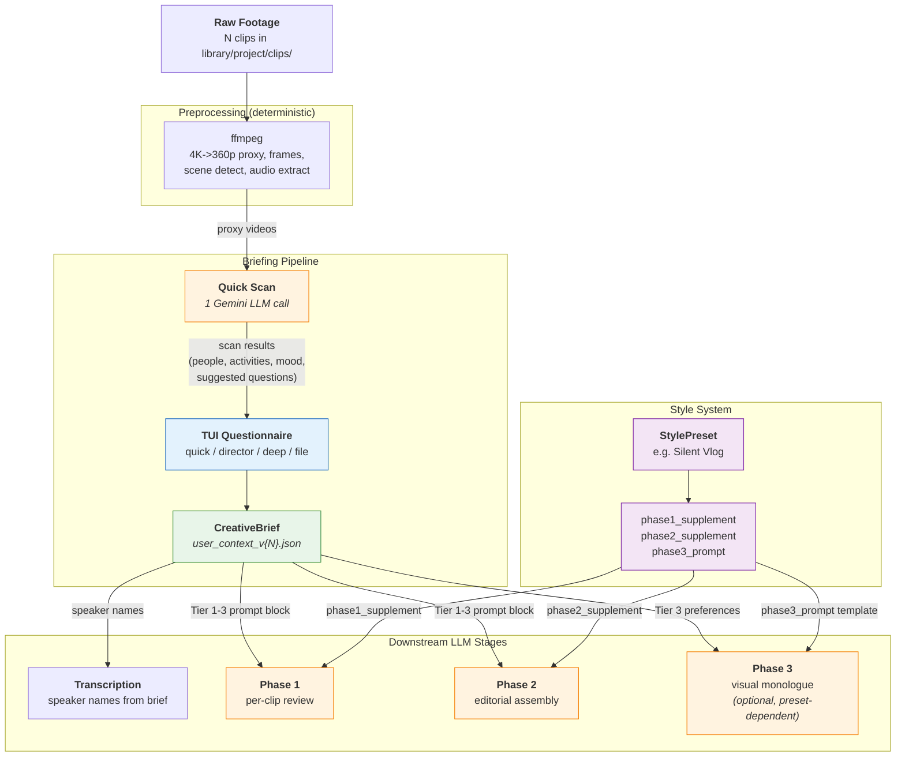

---

## 2. Quick Scan (Gemini File API + Structured Output)

The AI's first look at the footage. One cheap LLM call that produces structured observations used to ask smarter briefing questions.

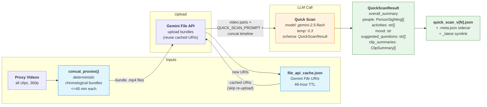

### QuickScanResult Schema

| Field | Type | Description |
|-------|------|-------------|
| `overall_summary` | `str` | 2-3 sentences about the footage as a whole |
| `people` | `PersonSighting[]` | Each: description, estimated_appearances, role_guess |
| `activities` | `str[]` | Activities, locations, events observed |
| `mood` | `str` | Overall energy/vibe |
| `suggested_questions` | `str[]` | Context questions the AI wants answered |
| `clip_summaries` | `ClipSummary[]` | Per-clip one-liner + energy level |

---

## 3. Smart Briefing Flow (TUI Questionnaire)

Interactive user interview with four depth levels, producing a `CreativeBrief`.

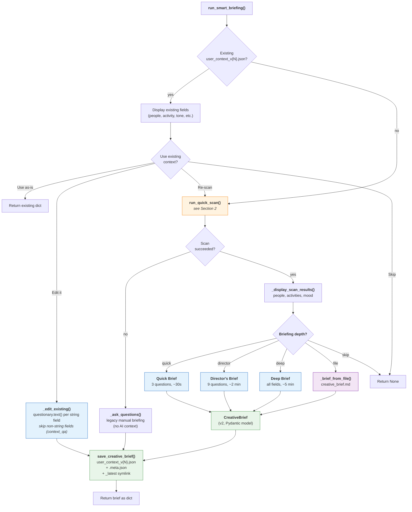

---

## 4. Briefing Depth Comparison

What each depth level asks and which `CreativeBrief` fields it populates.

```mermaid
graph TD
    subgraph "Quick Brief (3 Qs, ~30s)"
        Q1_Q["People<br/><i>(pre-populated from scan)</i>"]
        Q2_Q["Activity"]
        Q3_Q["Must-include / exclude<br/><i>(combined single question)</i>"]
    end

    subgraph "Director's Brief (9 Qs, ~2 min)"
        Q1_D["People"]
        Q2_D["Activity"]
        Q3_D["AI-suggested Q&A<br/><i>(from scan.suggested_questions)</i>"]
        Q4_D["Intent<br/><i>'what should viewers feel?'</i>"]
        Q5_D["Audience<br/><i>platform selector</i>"]
        Q6_D["Tone<br/><i>preset selector + custom</i>"]
        Q7_D["Pacing<br/><i>slow / balanced / punchy / builds</i>"]
        Q8_D["Must-include"]
        Q9_D["Must-exclude"]
        Q10_D["Duration"]
    end

    subgraph "Deep Brief (~5 min)"
        DALL["All Director's questions<br/>+"]
        D1["Story thesis"]
        D2["Key beats<br/><i>(comma-separated, ordered)</i>"]
        D3["Story hook / opening"]
        D4["Ending note"]
        D5["Structure<br/><i>chrono / thematic / circular / vignettes</i>"]
        D6["Music direction"]
        D7["Visual tone"]
        D8["Style references"]
        D9["Free notes"]
    end

    subgraph "File Mode"
        FM["<b>creative_brief.md</b><br/><i>opened in $EDITOR</i><br/>freeform prose/bullets<br/>any format"]
        FM --> PARSE["<b>parse_creative_brief_md()</b><br/>strip boilerplate<br/>extract raw text"]
        PARSE --> CDT["CreativeBrief with<br/>creative_direction_text = raw text"]
    end

    Q1_Q --> BQ["<b>CreativeBrief</b><br/>people, activity, highlights"]
    Q1_D --> BD["<b>CreativeBrief</b><br/>+ intent, audience, tone,<br/>pacing, context_qa, duration"]
    DALL --> BDP["<b>CreativeBrief</b><br/>+ narrative (thesis, beats,<br/>hook, ending, structure)<br/>+ style (music, visual_tone)<br/>+ references, notes"]

    style BQ fill:#e8f5e9,stroke:#388e3c
    style BD fill:#e8f5e9,stroke:#388e3c
    style BDP fill:#e8f5e9,stroke:#388e3c
    style CDT fill:#e8f5e9,stroke:#388e3c
    style FM fill:#f3e5f5,stroke:#7b1fa2
```

---

## 5. File-Based Creative Direction (`creative_brief.md`)

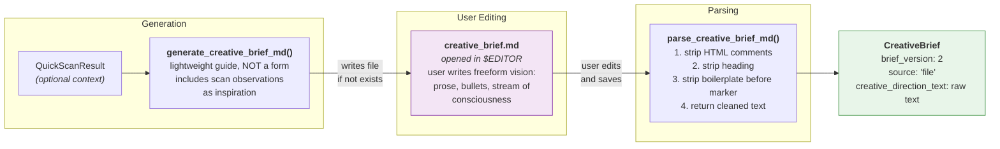

---

## 6. CreativeBrief Model

The single data structure that carries all user creative direction through the pipeline.

```mermaid
graph TD
    subgraph "Legacy Fields (v1 compatible)"
        L1["people: str"]
        L2["activity: str"]
        L3["tone: str"]
        L4["highlights: str"]
        L5["avoid: str"]
        L6["duration: str"]
        L7["context_qa: list[dict]<br/><i>[{question, answer}]</i>"]
    end

    subgraph "Enhanced Fields (v2)"
        E1["intent: str<br/><i>'what should viewers feel?'</i>"]
        E2["audience: AudienceSpec<br/><i>platform, viewer</i>"]
        E3["narrative: NarrativeDirection<br/><i>thesis, hook, key_beats,<br/>ending, structure</i>"]
        E4["style: StyleDirection<br/><i>pacing, music, energy,<br/>transitions, visual_tone</i>"]
        E5["references: list[str]"]
        E6["notes: str"]
        E7["creative_direction_text: str<br/><i>raw freeform from file</i>"]
    end

    subgraph "Metadata"
        M1["brief_version: 1 or 2"]
        M2["source: 'tui' | 'file' | 'preset'"]
        M3["preset_key: str"]
    end

    subgraph "Methods"
        HCD["has_creative_direction() -> bool<br/><i>true if any v2 field populated</i>"]
        TLD["to_legacy_dict() -> dict<br/><i>export people, activity, tone,<br/>highlights, avoid, duration, context_qa</i>"]
    end

    L1 & L2 & L3 & L4 & L5 & L6 & L7 --> CB2["<b>CreativeBrief</b>"]
    E1 & E2 & E3 & E4 & E5 & E6 & E7 --> CB2
    M1 & M2 & M3 --> CB2
    CB2 --> HCD
    CB2 --> TLD

    style CB2 fill:#e8f5e9,stroke:#388e3c
```

---

## 7. Three-Tier Prompt Formatting

How `CreativeBrief` is transformed into prompt text injected into LLM calls via `format_brief_for_prompt()`.

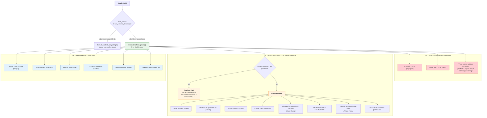

**Phase-specific behavior:**
- `phase="phase1"`: Omits key beats, opening, ending, transitions, visual tone (not relevant for single-clip review)
- `phase="phase2"`: Includes all fields (full editorial context for assembly)

---

## 8. Style Preset System

Curated, genre-specific prompt supplements that shape LLM behavior across all phases. Distinct from briefing (user context) — presets are controlled creative templates.

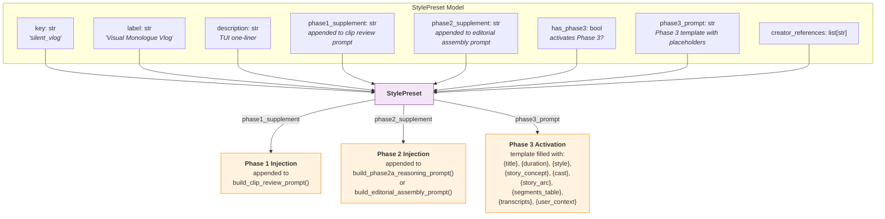

### Silent Vlog Preset: What Each Supplement Does

| Phase | Supplement Focus | Key Instructions |
|-------|-----------------|------------------|
| **Phase 1** | Text placement evaluation | Rate negative space, text_readability (good/fair/poor), ambient audio quality, speech vs. non-speech segments |
| **Phase 2** | Story structure for visual monologue | Opening 15-20% must establish context (NO speech), scenery-conversation-scenery alternation, 15-20% non-speech for text overlay, mark SPEECH vs SCENERY segments |
| **Phase 3** | Text overlay generation | Persona (conversational/observer/stream), ALL LOWERCASE, 5-8 words, two-breath rule, ONLY on scenery segments, lower_third position, arc structure |

---

## 9. How Briefing & Style Feed Into Each LLM Phase

Concrete data flow showing exactly which artifacts each phase consumes and how.

### 9.1 Phase 1: Per-Clip Review

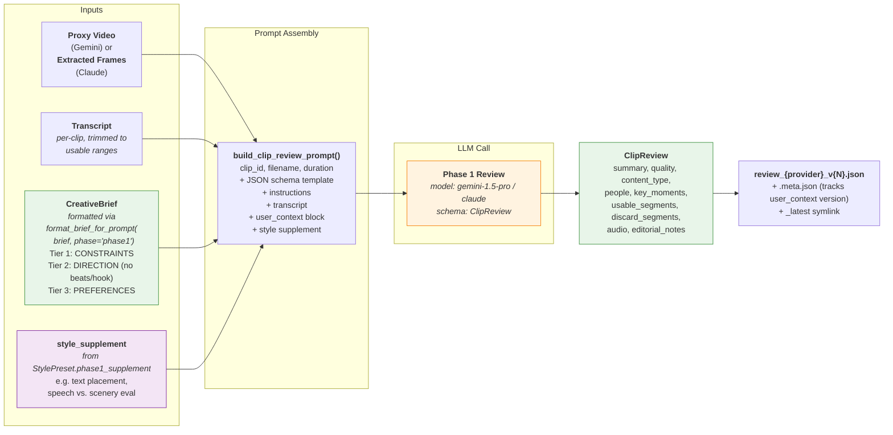

### 9.2 Phase 2: Editorial Assembly (Gemini Split Pipeline)

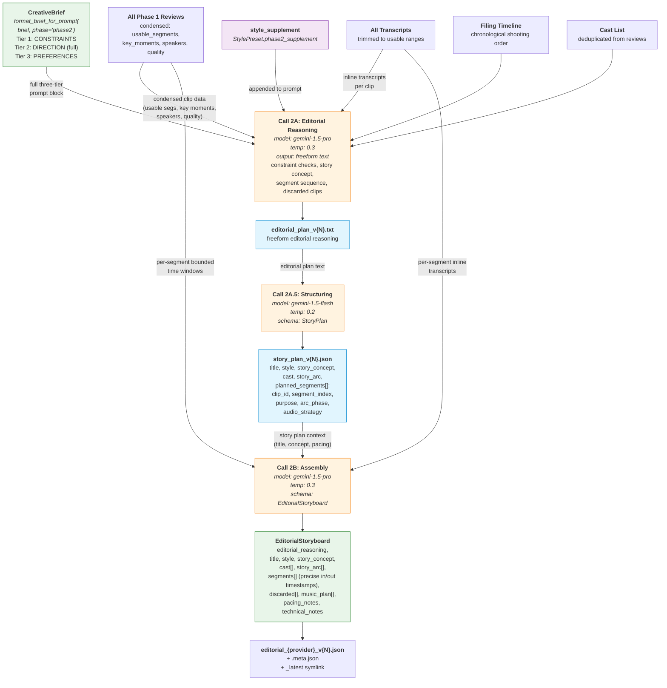

### 9.3 Phase 3: Visual Monologue (Style-Dependent, Split Pipeline)

Only runs when `StylePreset.has_phase3 == True` (e.g., Silent Vlog).

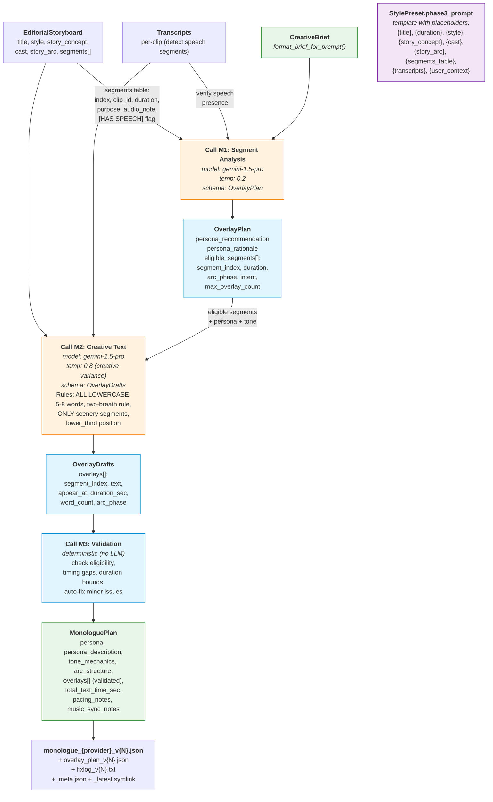

---

## 10. Gemini File API Cache (`file_cache.py`)

Shared upload cache that prevents re-uploading proxy videos across pipeline stages.

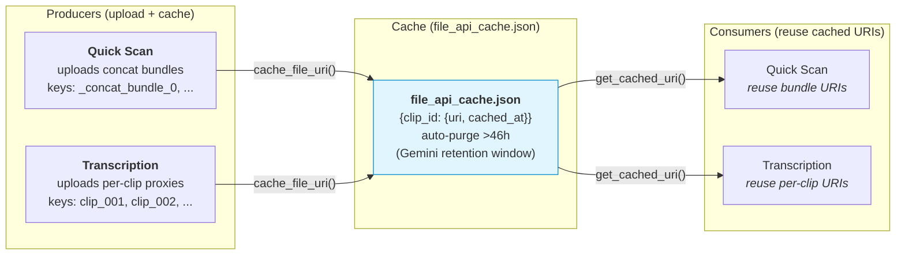

---

## 11. Versioning & Artifact Storage

All briefing artifacts follow the two-phase commit pattern from `versioning.py`.

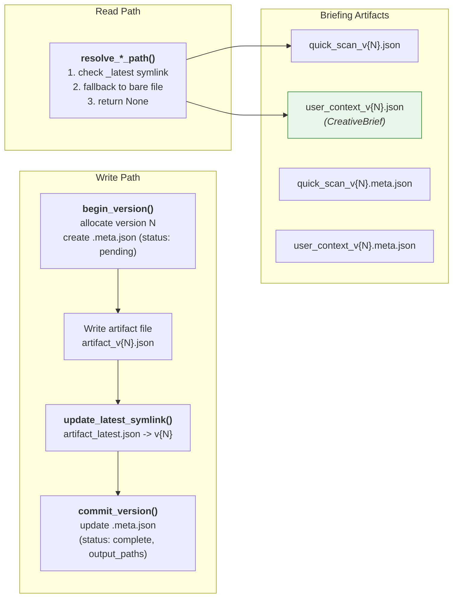

### Artifact Summary

| Artifact | File | Producer | Consumers |
|----------|------|----------|-----------|
| Quick Scan | `quick_scan_v{N}.json` | `run_quick_scan()` | TUI questionnaire, `creative_brief.md` generation |
| Creative Brief | `user_context_v{N}.json` | `run_smart_briefing()` / `run_briefing()` | Transcription (speaker names), Phase 1, Phase 2, Phase 3 |
| File API Cache | `file_api_cache.json` | Quick Scan uploads, Transcription uploads | Quick Scan (reuse), Transcription (reuse) |
| Creative Brief MD | `creative_brief.md` | `generate_creative_brief_md()` | `parse_creative_brief_md()` |

---

## Color Legend

| Color | Meaning |
|-------|---------|
| Orange (`#fff3e0`) | LLM call |
| Green (`#e8f5e9`) | Final / saved artifact |
| Blue (`#e1f5fe`) | Deterministic / intermediate artifact |
| Purple (`#f3e5f5`) | Style preset / file-based input |
| Light blue (`#e3f2fd`) | User interaction (TUI) |
| Red (`#ffcdd2`) | Constraint (non-negotiable) |
