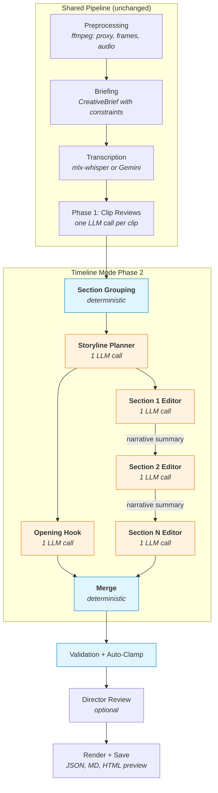
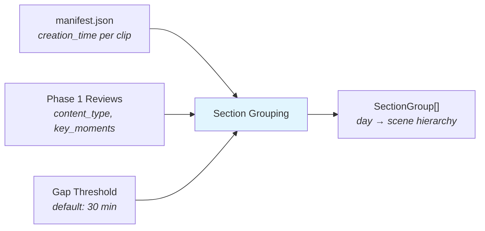
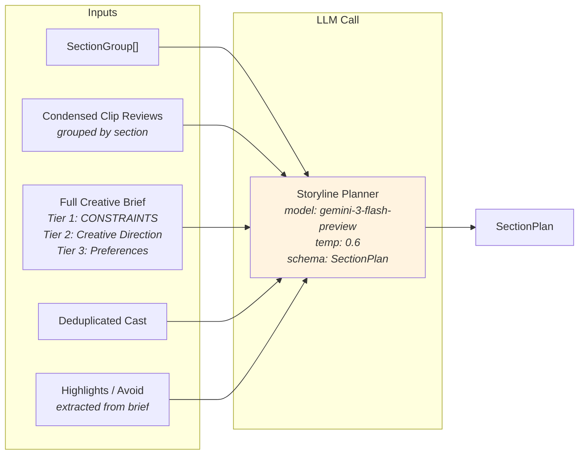
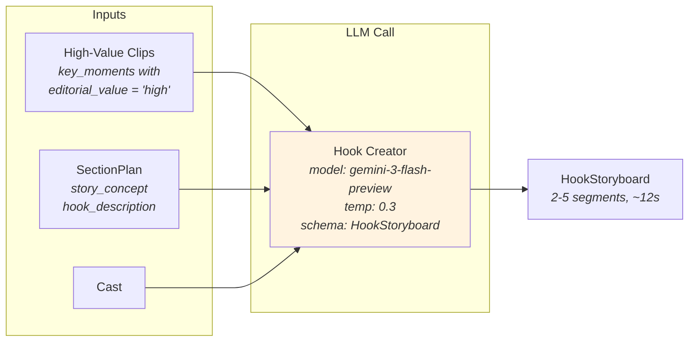
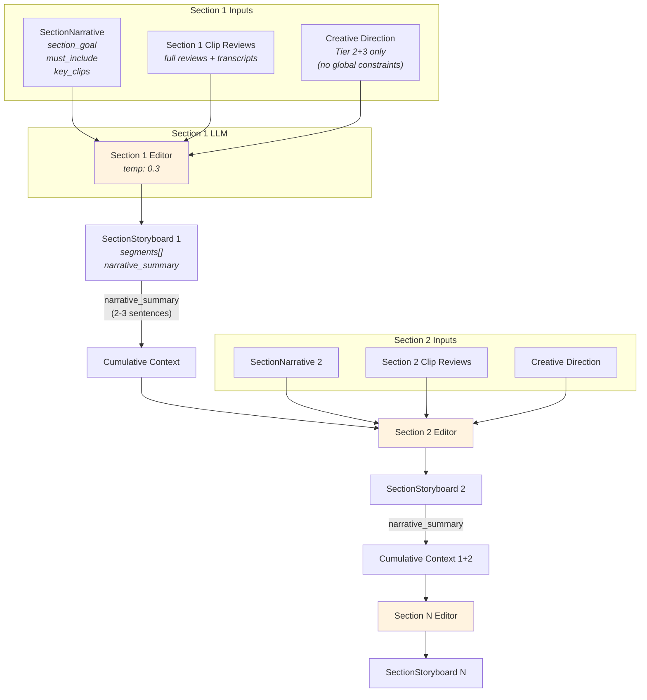
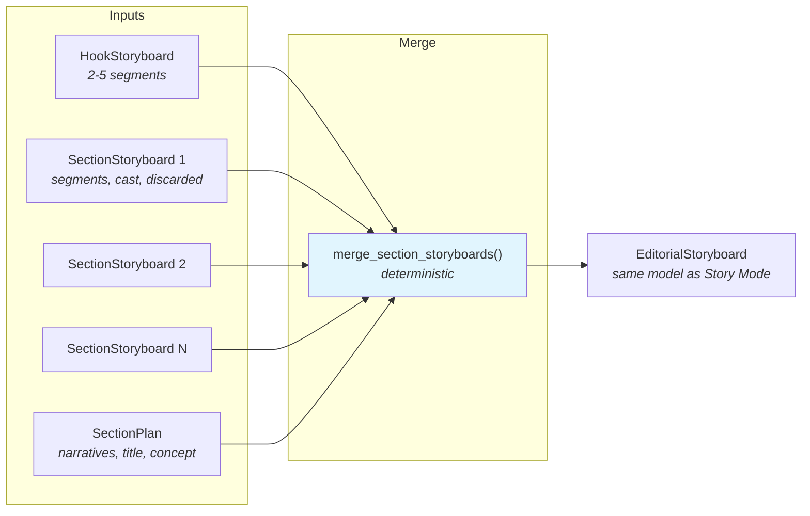
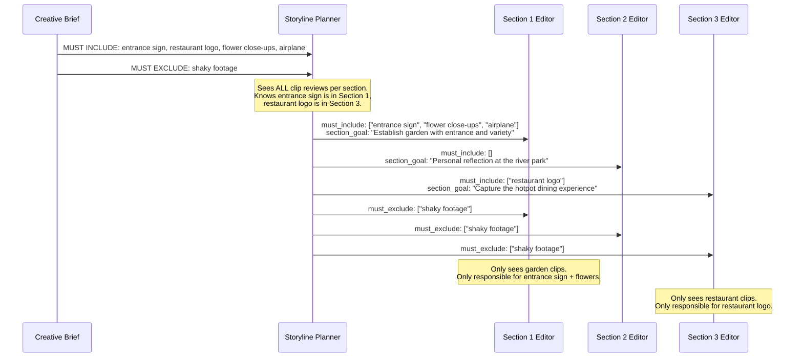

# Timeline Mode: System Design

Timeline Mode is an alternative Phase 2 editorial pipeline that enforces chronological order for vlog-style videos. Instead of giving the LLM all clips at once (Story Mode), it groups footage into scenes, plans the narrative arc, then edits each scene independently with focused goals.

## Why Timeline Mode Exists

When given 20-50 clips at once, LLMs consistently break chronological order in vlogs — reordering scenes "creatively" in ways that destroy the narrative timeline. Timeline Mode enforces chronological order **structurally** (by pipeline design, not by hoping the LLM complies) while preserving full aesthetic freedom within each scene.

## Pipeline Overview



**Legend**: Blue = deterministic (no LLM) | Orange = LLM call

**LLM call count**: 2 + N (storyline + hook + one per section). For a 3-section project: 5 LLM calls.

---

## Node-by-Node Design

### 1. Section Grouping (deterministic)

Groups clips into a hierarchical day → scene structure using metadata from the manifest.



| Input | Source | Used For |
|-------|--------|----------|
| `manifest.clips[].creation_time` | ffprobe during preprocessing | Tier 1: group by date |
| `manifest.clips[].duration_sec` | ffprobe during preprocessing | Tier 2: calculate gaps between clips |
| `clip_reviews[].content_type` | Phase 1 LLM review | Label sections (e.g., "talking_head" → "Interview") |
| `clip_reviews[].key_moments` | Phase 1 LLM review | Label sections from high-value moment descriptions |
| `gap_threshold_minutes` | Config (default 30) | Tier 2: split within date when gap exceeds threshold |

**Algorithm**:
1. Parse `creation_time` (ISO 8601) → group clips by calendar date
2. Within each date, sort by time → split when gap between consecutive clips exceeds threshold
3. Enrich section labels from Phase 1 review content

**Output**: `list[SectionGroup]`
```
SectionGroup
  ├── group_id: "day1"
  ├── date: "2026-04-05"
  ├── label: "Day 1 — Apr 05"
  └── sections:
        ├── Section(section_id="day1_scene1", label="Rose garden", clip_ids=[...], time_range="09:39-10:05")
        ├── Section(section_id="day1_scene2", label="River park", clip_ids=[...], time_range="10:29-10:29")
        └── Section(section_id="day1_scene3", label="Restaurant", clip_ids=[...], time_range="11:00-11:12")
```

**Artifact saved**: `storyboard/sections_latest.json`

---

### 2. Storyline Planner (1 LLM call)

The "editor's planning session" — sees everything, distributes work to sections.



**What the LLM sees per section** (condensed reviews, not just summaries):
```
### Rose garden (day1_scene1)
Day: Day 1 — Apr 05 | Time: 09:39-10:05
Clips: 37

  **IMG_9798** (5s) — ['landscape']
    - [2s] Wide shot of Taipei Rose Garden from entrance (value: high)
  **IMG_9816** (8s) — ['establishing']
    - [3s] Entrance sign with festival banner (value: high)
    - Speech: "We are now at the Taipei Rose Garden..."
  ...
```

**Constraint distribution instruction**:
```
CONSTRAINT DISTRIBUTION:
- MUST INCLUDE: the entrance sign of the rose garden, event infos, ...
- MUST EXCLUDE: ...

For each constraint, determine WHICH SECTION can satisfy it based on
the clip reviews. Assign it to that section's must_include or must_exclude.
DO NOT assign a constraint to a section that lacks the relevant footage.
```

**Output**: `SectionPlan`

| Field | Purpose |
|-------|---------|
| `title` | Creative video title |
| `story_concept` | 2-3 sentence narrative thesis |
| `section_narratives[]` | Per-section assignments (see below) |
| `hook_section_id` | Which section provides hook material |
| `hook_description` | What the hook should show |
| `constraint_satisfaction` | Explains any unresolvable constraints |
| `pacing_notes` | Overall rhythm strategy |
| `music_direction` | Audio approach |

**Per-section narrative** (`SectionNarrative`):

| Field | Purpose |
|-------|---------|
| `section_id` | Links to `Section.section_id` |
| `narrative_role` | What this section contributes to the arc |
| `arc_phase` | opening_context / rising_action / experience / climax / closing_reflection |
| `energy` | high / medium / low |
| `target_duration_sec` | Suggested duration |
| `section_goal` | **Focused editorial objective** for this section |
| `must_include` | **Constraints assigned to THIS section** (not global) |
| `must_exclude` | Avoidance constraints for this section |
| `key_clips` | Specific clip_ids to prioritize |

**Artifact saved**: `storyboard/storyline_latest.json`

---

### 3. Opening Hook (1 LLM call)

Creates a cinematic 10-15 second teaser from the best moments across all sections.



| Input | Source | Details |
|-------|--------|---------|
| High-value clips | Filtered from all clip reviews | Only clips with at least one `key_moment.editorial_value == "high"` |
| `section_plan.story_concept` | Storyline output | Narrative context for hook tone |
| `section_plan.hook_description` | Storyline output | Specific direction for what hook should show |

**Output**: `HookStoryboard` — 2-5 `Segment` objects (~10-15s total), plus `hook_concept` explanation.

**Instructions**: Quick cuts (2-4s each), `audio_note = "music_bed"`, `transition = "cut"` for energy.

---

### 4. Per-Section Editor (N sequential LLM calls)

Each section is edited independently with focused goals. Sections run sequentially so each receives a narrative summary from all prior sections.



**What each section editor receives**:

| Input | Source | Details |
|-------|--------|---------|
| `section_narrative.section_goal` | Storyline output | "Establish the garden atmosphere with entrance shots and flower close-ups" |
| `section_narrative.must_include` | Storyline output | Only constraints this section CAN satisfy |
| `section_narrative.must_exclude` | Storyline output | Only avoidances relevant here |
| `section_narrative.key_clips` | Storyline output | Specific clips to prioritize |
| Section clip reviews | Phase 1 reviews, filtered | Full reviews with key_moments, usable_segments |
| Section transcripts | Transcription, filtered | Speech text for natural cut points |
| Creative direction | Brief (Tier 2+3) | Intent, style, pacing — NO global constraints |
| Cumulative narratives | Prior section outputs | "Section 1 covered the garden entrance and flower beds..." |
| Style supplement | Style preset | Additional creative guidance |

**Key instruction**: "Within YOUR section, order clips for the best aesthetic flow. B-roll, signs, and close-ups can go wherever they serve the narrative best. You are NOT bound to chronological order within this section."

**Output**: `SectionStoryboard`

| Field | Purpose |
|-------|---------|
| `segments[]` | Ordered segments with in_sec/out_sec timestamps |
| `narrative_summary` | 2-3 sentences passed to next section as context |
| `discarded[]` | Clips from this section not used, with reasons |
| `cast[]` | People identified in this section |
| `music_cue` | Music strategy for this section |
| `editorial_reasoning` | Thinking process |

---

### 5. Merge (deterministic)

Combines hook + all section storyboards into the final `EditorialStoryboard`.



**Merge operations**:
1. **Segments**: Hook first, then each section in order → re-index 0..N sequentially
2. **Story arc**: One `StoryArcSection` per section (title from narrative_role, description from narrative_summary)
3. **Cast**: Union all, deduplicate by normalized name
4. **Discarded**: Union all
5. **Music plan**: Collect all section music cues
6. **Editorial reasoning**: Concatenate `[Hook] ...`, `[day1_scene1] ...`, `[day1_scene2] ...`
7. **Metadata**: title, style, story_concept from SectionPlan; duration computed from segments

**Output**: Standard `EditorialStoryboard` — fully backward compatible with Story Mode output. All downstream code (render, rough cut, FCPXML, director review, eval) works unchanged.

---

### 6. Post-Processing (shared with Story Mode)

1. **Clip ID resolution** — fixes LLM abbreviations (`C0073` → `20260330114125_C0073`)
2. **Timestamp auto-clamping** — clamps each segment to its clip's usable_segment bounds
3. **Validation** — checks clip_id existence, in < out, duration bounds, no duplicate indices
4. **Director review** (optional) — autonomous agent reviews the merged storyboard

---

## Constraint Distribution Flow

The critical design decision: constraints are resolved at the planning stage, not at the section editing stage.



---

## File Reference

| File | Key Functions |
|------|--------------|
| `editorial_agent.py` | `_run_phase2_sections()` — pipeline orchestration |
| `editorial_prompts.py` | `build_storyline_prompt()`, `build_hook_prompt()`, `build_section_storyboard_prompt()` |
| `section_grouping.py` | `group_clips_into_sections()`, `merge_section_storyboards()`, `format_sections_for_display()` |
| `models.py` | `Section`, `SectionGroup`, `SectionNarrative`, `SectionPlan`, `SectionStoryboard`, `HookStoryboard` |
| `briefing.py` | `format_brief_for_prompt(skip_constraints=True\|False)` |
| `config.py` | `GeminiConfig.use_timeline_mode`, `.section_gap_minutes` |
