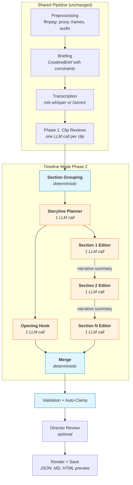
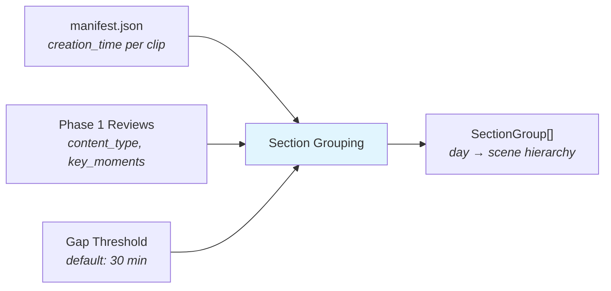
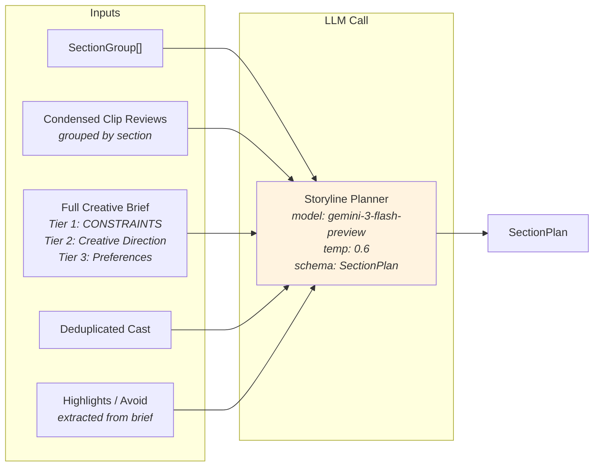
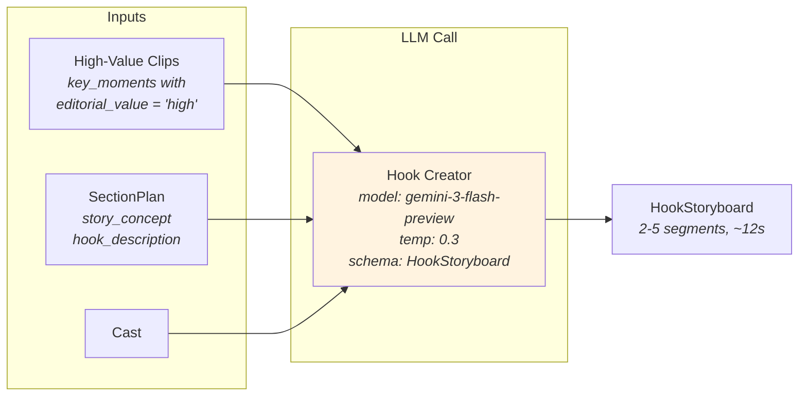
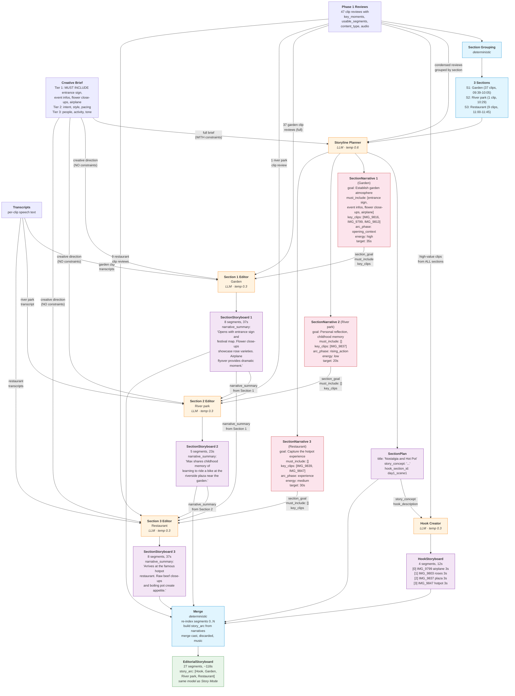
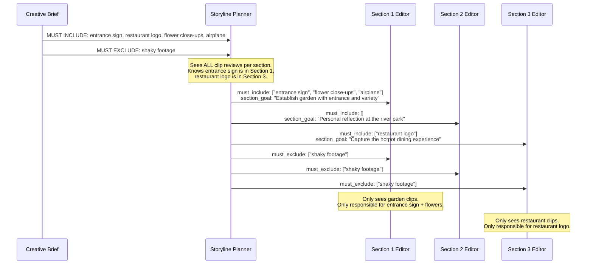

# Timeline Mode: System Design

Timeline Mode is an alternative Phase 2 editorial pipeline that enforces chronological order for vlog-style videos. Instead of giving the LLM all clips at once (Story Mode), it groups footage into scenes, plans the narrative arc, then edits each scene independently with focused goals.

## Why Timeline Mode Exists

When given 20-50 clips at once, LLMs consistently break chronological order in vlogs — reordering scenes "creatively" in ways that destroy the narrative timeline. Timeline Mode enforces chronological order **structurally** (by pipeline design, not by hoping the LLM complies) while preserving full aesthetic freedom within each scene.

## Pipeline Overview



**Legend**: Blue = deterministic (no LLM) | Orange = LLM call

**LLM call count**: 2 + N (storyline + hook + one per section). For a 3-section project: 5 LLM calls.

---

## Node-by-Node Design

### 1. Section Grouping (deterministic)

Groups clips into a hierarchical day → scene structure using metadata from the manifest.



| Input | Source | Used For |
|-------|--------|----------|
| `manifest.clips[].creation_time` | ffprobe during preprocessing | Tier 1: group by date |
| `manifest.clips[].duration_sec` | ffprobe during preprocessing | Tier 2: calculate gaps between clips |
| `clip_reviews[].content_type` | Phase 1 LLM review | Label sections (e.g., "talking_head" → "Interview") |
| `clip_reviews[].key_moments` | Phase 1 LLM review | Label sections from high-value moment descriptions |
| `gap_threshold_minutes` | Config (default 30) | Tier 2: split within date when gap exceeds threshold |

**Algorithm**:
1. Parse `creation_time` (ISO 8601) → group clips by calendar date
2. Within each date, sort by time → split when gap between consecutive clips exceeds threshold
3. Enrich section labels from Phase 1 review content

**Output**: `list[SectionGroup]`
```
SectionGroup
  ├── group_id: "day1"
  ├── date: "2026-04-05"
  ├── label: "Day 1 — Apr 05"
  └── sections:
        ├── Section(section_id="day1_scene1", label="Rose garden", clip_ids=[...], time_range="09:39-10:05")
        ├── Section(section_id="day1_scene2", label="River park", clip_ids=[...], time_range="10:29-10:29")
        └── Section(section_id="day1_scene3", label="Restaurant", clip_ids=[...], time_range="11:00-11:12")
```

**Artifact saved**: `storyboard/sections_latest.json`

---

### 2. Storyline Planner (1 LLM call)

The "editor's planning session" — sees everything, distributes work to sections.



**What the LLM sees per section** (condensed reviews, not just summaries):
```
### Rose garden (day1_scene1)
Day: Day 1 — Apr 05 | Time: 09:39-10:05
Clips: 37

  **IMG_9798** (5s) — ['landscape']
    - [2s] Wide shot of Taipei Rose Garden from entrance (value: high)
  **IMG_9816** (8s) — ['establishing']
    - [3s] Entrance sign with festival banner (value: high)
    - Speech: "We are now at the Taipei Rose Garden..."
  ...
```

**Constraint distribution instruction**:
```
CONSTRAINT DISTRIBUTION:
- MUST INCLUDE: the entrance sign of the rose garden, event infos, ...
- MUST EXCLUDE: ...

For each constraint, determine WHICH SECTION can satisfy it based on
the clip reviews. Assign it to that section's must_include or must_exclude.
DO NOT assign a constraint to a section that lacks the relevant footage.
```

**Output**: `SectionPlan`

| Field | Purpose |
|-------|---------|
| `title` | Creative video title |
| `story_concept` | 2-3 sentence narrative thesis |
| `section_narratives[]` | Per-section assignments (see below) |
| `hook_section_id` | Which section provides hook material |
| `hook_description` | What the hook should show |
| `constraint_satisfaction` | Explains any unresolvable constraints |
| `pacing_notes` | Overall rhythm strategy |
| `music_direction` | Audio approach |

**Per-section narrative** (`SectionNarrative`):

| Field | Purpose |
|-------|---------|
| `section_id` | Links to `Section.section_id` |
| `narrative_role` | What this section contributes to the arc |
| `arc_phase` | opening_context / rising_action / experience / climax / closing_reflection |
| `energy` | high / medium / low |
| `target_duration_sec` | Suggested duration |
| `section_goal` | **Focused editorial objective** for this section |
| `must_include` | **Constraints assigned to THIS section** (not global) |
| `must_exclude` | Avoidance constraints for this section |
| `key_clips` | Specific clip_ids to prioritize |

**Artifact saved**: `storyboard/storyline_latest.json`

---

### 3. Opening Hook (1 LLM call)

Creates a cinematic 10-15 second teaser from the best moments across all sections.



| Input | Source | Details |
|-------|--------|---------|
| High-value clips | Filtered from all clip reviews | Only clips with at least one `key_moment.editorial_value == "high"` |
| `section_plan.story_concept` | Storyline output | Narrative context for hook tone |
| `section_plan.hook_description` | Storyline output | Specific direction for what hook should show |

**Output**: `HookStoryboard` — 2-5 `Segment` objects (~10-15s total), plus `hook_concept` explanation.

**Instructions**: Quick cuts (2-4s each), `audio_note = "music_bed"`, `transition = "cut"` for energy.

---

### 4. Per-Section Editor → Merge (concrete 3-section example)

This diagram shows the exact artifacts created and consumed by each LLM call, using the rose garden project (3 sections: garden, river park, restaurant) as a concrete example.



**Color legend**: Blue = deterministic | Orange = LLM call | Pink = LLM output (SectionNarrative) | Purple = LLM output (artifacts) | Green = final output

### What each section editor actually receives in its prompt

**Section 1 (Garden) — 37 clips, first to run:**

```
## Your Section: Rose garden (day1_scene1)
Narrative role: Establish the setting and sense of wonder
Arc phase: opening_context
Energy: high
Target duration: ~35s

**Section Goal**: Establish garden atmosphere with entrance shots,
festival info, and a variety of flower close-ups. End with the
dramatic airplane flyover as a transition moment.

**MUST INCLUDE** (assigned to this section by the editor):
  - the entrance sign of the rose garden
  - event infos
  - multiple different kinds of flower's close-up
  - airplane fly through over the head

**Key clips to prioritize**: IMG_9816, IMG_9799, IMG_9813, IMG_9804

## Creative Direction                          ← Tier 2+3 only, NO constraints
NORTH STAR: The viewer should feel the warmth of a relaxed holiday.
PACING: balanced
MUSIC: acoustic

## Clips in This Section (37 clips)
### IMG_9798 (5.0s) — ['landscape']
  Key moment [2.0s]: Wide establishing shot (value: high, use: establishing)
  Usable [0]: 0.0-5.0s (5.0s) — Wide landscape
### IMG_9816 (8.0s) — ['establishing']
  Key moment [3.0s]: Entrance sign with banner (value: high, use: establishing)
  ...
```

**Section 2 (River park) — 1 clip, receives Section 1's summary:**

```
## Your Section: River park (day1_scene2)
Narrative role: Personal reflection and childhood memory
Arc phase: rising_action
Energy: low
Target duration: ~20s

**Section Goal**: Personal reflection at the riverside plaza
where Max learned to ride a bike as a child.

                                          ← NO must_include (none assigned here)

**Key clips to prioritize**: IMG_9837

## Creative Direction
NORTH STAR: The viewer should feel the warmth of a relaxed holiday.

## Story So Far (prior sections)

**day1_scene1**: Opens with entrance sign and festival map.
Flower close-ups showcase rose varieties including reds, pinks,
and lavenders. Airplane flyover provides dramatic moment.

## Clips in This Section (1 clip)
### IMG_9837 (42.0s) — ['landscape', 'talking_head']
  Key moment [5.0s]: Childhood bike riding memory (value: high)
  Usable [0]: 1.0-5.0s (4.0s) — Plaza establishing shot
  Usable [1]: 9.0-25.0s (16.0s) — Narration about childhood
  ...
  Transcript: "This is the plaza where I learned to ride a bike..."
```

**Section 3 (Restaurant) — 9 clips, receives Sections 1+2 summaries:**

```
## Your Section: Restaurant (day1_scene3)
Narrative role: Capture the hotpot dining experience
Arc phase: experience
Energy: medium
Target duration: ~30s

**Section Goal**: Capture the hotpot dining experience at the
famous 牛老大 restaurant with food close-ups and conversation.

                                          ← NO must_include (none assigned here)

**Key clips to prioritize**: IMG_9839, IMG_9847

## Creative Direction
NORTH STAR: The viewer should feel the warmth of a relaxed holiday.

## Story So Far (prior sections)

**day1_scene1**: Opens with entrance sign and festival map.
Flower close-ups showcase rose varieties. Airplane flyover
provides dramatic moment.

**day1_scene2**: Max shares childhood memory of learning to
ride a bike at the riverside plaza near the garden.

## Clips in This Section (9 clips)
### IMG_9839 (12.0s) — ['action']
  Key moment [3.0s]: Counter ordering (value: medium)
  ...
### IMG_9847 (60.0s) — ['action', 'talking_head']
  Key moment [5.0s]: Beef swirling in hotpot (value: high)
  ...
  Transcript: "This is 牛老大, famous for their warm-bodied beef..."
```

### 5. Merge (deterministic)

Combines hook + all section storyboards into the final `EditorialStoryboard`.

**Merge operations**:
1. **Segments**: Hook segments [0-3], then Section 1 [4-11], Section 2 [12-16], Section 3 [17-24] → re-indexed 0..24
2. **Story arc**: 4 entries: "Opening Hook", "Garden atmosphere", "Personal reflection", "Hotpot experience"
3. **Cast**: Union all section casts, deduplicate by normalized name
4. **Discarded**: Union all section discarded clips
5. **Music plan**: Collect music cues from each section
6. **Editorial reasoning**: Concatenate `[Hook] ...`, `[day1_scene1] ...`, `[day1_scene2] ...`, `[day1_scene3] ...`
7. **Metadata**: title, style, story_concept from SectionPlan; duration from segment sum

**Output**: Standard `EditorialStoryboard` — fully backward compatible with Story Mode output. All downstream code (render, rough cut, FCPXML, director review, eval) works unchanged.

---

### 6. Post-Processing (shared with Story Mode)

1. **Clip ID resolution** — fixes LLM abbreviations (`C0073` → `20260330114125_C0073`)
2. **Timestamp auto-clamping** — clamps each segment to its clip's usable_segment bounds
3. **Validation** — checks clip_id existence, in < out, duration bounds, no duplicate indices
4. **Director review** (optional) — autonomous agent reviews the merged storyboard

---

## Constraint Distribution Flow

The critical design decision: constraints are resolved at the planning stage, not at the section editing stage.



---

## File Reference

| File | Key Functions |
|------|--------------|
| `editorial_agent.py` | `_run_phase2_sections()` — pipeline orchestration |
| `editorial_prompts.py` | `build_storyline_prompt()`, `build_hook_prompt()`, `build_section_storyboard_prompt()` |
| `section_grouping.py` | `group_clips_into_sections()`, `merge_section_storyboards()`, `format_sections_for_display()` |
| `models.py` | `Section`, `SectionGroup`, `SectionNarrative`, `SectionPlan`, `SectionStoryboard`, `HookStoryboard` |
| `briefing.py` | `format_brief_for_prompt(skip_constraints=True\|False)` |
| `config.py` | `GeminiConfig.use_timeline_mode`, `.section_gap_minutes` |
